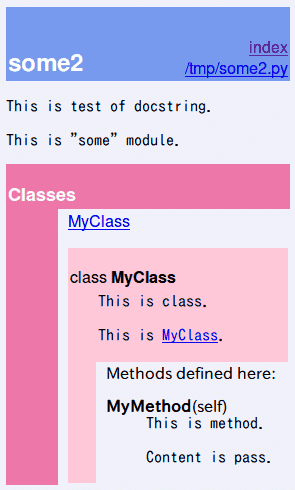

# [4.7.6. ドキュメンテーション文字列](https://docs.python.jp/3/tutorial/controlflow.html#documentation-strings)

< [4.7. 関数定義についてもう少し](https://docs.python.jp/3/tutorial/controlflow.html#more-on-defining-functions) < [4. その他の制御フローツール](https://docs.python.jp/3/tutorial/controlflow.html#more-control-flow-tools) < [Python チュートリアル](https://docs.python.jp/3/tutorial/index.html) < [ドキュメント](https://docs.python.jp/3/index.html)

今回は深追いしすぎて蛇足。

## 書式

* 1行目は要約
    * 対象物の目的を短く簡潔にまとめたもの
* 2行目は空行
* 3行目は呼び出し規約や副作用について

```python
class MyClass:
    """This is test of docstring.
    
    Only ascii character.
    """
    def MyMethod(self):
        pass
```

## 調べた

上記だけだと普通のコメントと何ら変わりない。ドキュメント用コメントはHTML出力するために書くもののはず。どうやってHTML出力するのか一切説明がない。少し調べてみた。

* http://blog.amedama.jp/entry/2015/10/15/212527

### `help()`

`0.py`で`import 0`とすると`SyntaxError: invalid syntax`になってしまった。`some.py`にリネームすると成功。

```python
>>> import some
>>> help(some)
```
```sh
Help on module some:

NAME
    some

CLASSES
    builtins.object
        MyClass
    
    class MyClass(builtins.object)
     |  This is MyClass.
     |  
     |  This is test of docstring.
     |  
     |  Methods defined here:
     |  
     |  MyMethod(self)
     |  
     |  ----------------------------------------------------------------------
     |  Data descriptors defined here:
     |  
     |  __dict__
     |      dictionary for instance variables (if defined)
     |  
     |  __weakref__
     |      list of weak references to the object (if defined)

FILE
    /tmp/some.py

(END)
```

`(END)`のところで`q`を入力すると終了する。

### `__doc__`

```python
>>> some.MyClass.__doc__
'This is MyClass.\n    \n    This is test of docstring.\n    '
```

docstringは`__doc__`変数に代入されるらしい。

## HTML出力ツール

* pydoc
* Sphinx

ググったら上記を発見。pydocは標準なのでインストール不要。

## [pydoc](https://docs.python.jp/3/library/pydoc.html)

なぜ[pydoc](https://docs.python.jp/3/library/pydoc.html)のリンクを貼らなかったのか。早速ためしてみる。

### `pydoc モジュール名`

```sh
$ pydoc some
```
```sh
Help on module some:

NAME
    some

FILE
    /tmp/some.py

CLASSES
    MyClass
    
    class MyClass
     |  This is MyClass.
     |  
     |  This is test of docstring.
     |  
     |  Methods defined here:
     |  
     |  MyMethod(self)

(END)
```

`help()`と同じ結果になった。

### `pydoc -w モジュール名`

> 引数の前に -w フラグを指定すると、コンソールにテキストを表示させるかわりにカレントディレクトリにHTMLドキュメントを生成します。

HTML出力する。

```sh
$ pydoc -w some
wrote some.html
```

`some.html`を開いてブラウザで確認。


ダサい。引数や戻り値もないし、APIリファレンスにはなりえない。

### モジュール、クラス、メソッド

各所にコメントを書いてみる。

some2.py
```python
"""This is test of docstring.

This is "some" module.
"""
class MyClass:
    """This is class.

    This is MyClass.
    """
    def MyMethod(self):
        """This is method.
        
        Content is pass.
        """
        pass
```
```sh
$ pydoc -w some2
wrote some2.html
```



ダサい…。

## Sphinx

[Sphinx](http://sphinx-users.jp/)はスフィンクスと読む。

[こちら](https://docs.python.jp/3/about.html)によるとPythonドキュメントもSphinxで作られているらしい。
[reStructuredText](http://docutils.sourceforge.net/rst.html)形式という書式を用いるらしい。

インストールしてみる。

### 環境を確認する

```sh
$ python -V
Python 3.6.1
$ pip -V
pip 9.0.1 ... (python 3.6)
```

### パッケージ仮想環境を用意する

```sh
$ python -m venv /.../3.6.1/venv/document
$ cd /.../3.6.1/venv/document
$ source ./bin/activate
(document) $
```

venvコマンドについては[こちら](https://docs.python.jp/3/library/venv.html)を参照。

### インストールする

```sh
$ pip install sphinx
```
```sh
Collecting sphinx
  Downloading Sphinx-1.6.2-py2.py3-none-any.whl (1.9MB)
    100% |████████████████████████████████| 1.9MB 188kB/s 
Collecting snowballstemmer>=1.1 (from sphinx)
  Downloading snowballstemmer-1.2.1-py2.py3-none-any.whl (64kB)
    100% |████████████████████████████████| 71kB 2.1MB/s 
Collecting alabaster<0.8,>=0.7 (from sphinx)
  Downloading alabaster-0.7.10-py2.py3-none-any.whl
Collecting Pygments>=2.0 (from sphinx)
  Using cached Pygments-2.2.0-py2.py3-none-any.whl
Collecting requests>=2.0.0 (from sphinx)
  Downloading requests-2.17.3-py2.py3-none-any.whl (87kB)
    100% |████████████████████████████████| 92kB 2.3MB/s 
Requirement already satisfied: setuptools in ./lib/python3.6/site-packages (from sphinx)
Collecting six>=1.5 (from sphinx)
  Using cached six-1.10.0-py2.py3-none-any.whl
Collecting sphinxcontrib-websupport (from sphinx)
  Downloading sphinxcontrib_websupport-1.0.1-py2.py3-none-any.whl
Collecting imagesize (from sphinx)
  Downloading imagesize-0.7.1-py2.py3-none-any.whl
Collecting Jinja2>=2.3 (from sphinx)
  Using cached Jinja2-2.9.6-py2.py3-none-any.whl
Collecting docutils>=0.11 (from sphinx)
  Using cached docutils-0.13.1-py3-none-any.whl
Collecting babel!=2.0,>=1.3 (from sphinx)
  Downloading Babel-2.4.0-py2.py3-none-any.whl (6.8MB)
    100% |████████████████████████████████| 6.8MB 49kB/s 
Collecting chardet<3.1.0,>=3.0.2 (from requests>=2.0.0->sphinx)
  Downloading chardet-3.0.3-py2.py3-none-any.whl (133kB)
    100% |████████████████████████████████| 143kB 1.3MB/s 
Collecting idna<2.6,>=2.5 (from requests>=2.0.0->sphinx)
  Downloading idna-2.5-py2.py3-none-any.whl (55kB)
    100% |████████████████████████████████| 61kB 1.8MB/s 
Collecting certifi>=2017.4.17 (from requests>=2.0.0->sphinx)
  Downloading certifi-2017.4.17-py2.py3-none-any.whl (375kB)
    100% |████████████████████████████████| 378kB 736kB/s 
Collecting urllib3<1.22,>=1.21.1 (from requests>=2.0.0->sphinx)
  Downloading urllib3-1.21.1-py2.py3-none-any.whl (131kB)
    100% |████████████████████████████████| 133kB 1.2MB/s 
Collecting MarkupSafe>=0.23 (from Jinja2>=2.3->sphinx)
  Using cached MarkupSafe-1.0.tar.gz
Collecting pytz>=0a (from babel!=2.0,>=1.3->sphinx)
  Using cached pytz-2017.2-py2.py3-none-any.whl
Installing collected packages: snowballstemmer, alabaster, Pygments, chardet, idna, certifi, urllib3, requests, six, sphinxcontrib-websupport, imagesize, MarkupSafe, Jinja2, docutils, pytz, babel, sphinx
  Running setup.py install for MarkupSafe ... done
Successfully installed Jinja2-2.9.6 MarkupSafe-1.0 Pygments-2.2.0 alabaster-0.7.10 babel-2.4.0 certifi-2017.4.17 chardet-3.0.3 docutils-0.13.1 idna-2.5 imagesize-0.7.1 pytz-2017.2 requests-2.17.3 six-1.10.0 snowballstemmer-1.2.1 sphinx-1.6.2 sphinxcontrib-websupport-1.0.1 urllib3-1.21.1
```

### 初期設定

21件の質問に答える。以下5点以外はEnterキー押下でデフォルト値のまま。

* `autodoc`のところを`y`にするとソースコードからドキュメントを作ってくれる
* `Create Windows command file?`はWindowsでないため不要。`n`
* `Project language`は`ja`
* ルートパスはテストなので適当
* プロジェクト名、著者、バージョンも適当

```sh
$ sphinx-quickstart
```
```sh
Welcome to the Sphinx 1.6.2 quickstart utility.

Please enter values for the following settings (just press Enter to
accept a default value, if one is given in brackets).
```

ルートパスは？
```sh
Enter the root path for documentation.
> Root path for the documentation [.]: /tmp
```

ソースとビルドディレクトリを分離する？
```sh
You have two options for placing the build directory for Sphinx output.
Either, you use a directory "_build" within the root path, or you separate
"source" and "build" directories within the root path.
> Separate source and build directories (y/n) [n]: 
```

ファイル名のアンダースコアを別の文字に置き換える？
```sh
Inside the root directory, two more directories will be created; "_templates"
for custom HTML templates and "_static" for custom stylesheets and other static
files. You can enter another prefix (such as ".") to replace the underscore.
> Name prefix for templates and static dir [_]: 
```

プロジェクト名、著者は？
```sh
The project name will occur in several places in the built documentation.
> Project name: 4.7.6. ドキュメンテーション文字列
> Author name(s): pylangstudy
```

バージョンは？
```sh
Sphinx has the notion of a "version" and a "release" for the
software. Each version can have multiple releases. For example, for
Python the version is something like 2.5 or 3.0, while the release is
something like 2.5.1 or 3.0a1.  If you don't need this dual structure,
just set both to the same value.
> Project version []: 0.0.1
> Project release [0.0.1]: 
```

言語は？
```sh
If the documents are to be written in a language other than English,
you can select a language here by its language code. Sphinx will then
translate text that it generates into that language.

For a list of supported codes, see
http://sphinx-doc.org/config.html#confval-language.
> Project language [en]: ja
```

ドキュメントとする形式は？
```sh
The file name suffix for source files. Commonly, this is either ".txt"
or ".rst".  Only files with this suffix are considered documents.
> Source file suffix [.rst]: 
```

index.htmlのファイル名を変える？
```sh
One document is special in that it is considered the top node of the
"contents tree", that is, it is the root of the hierarchical structure
of the documents. Normally, this is "index", but if your "index"
document is a custom template, you can also set this to another filename.
> Name of your master document (without suffix) [index]: 
```

epubビルダーを使う？
```
Sphinx can also add configuration for epub output:
> Do you want to use the epub builder (y/n) [n]: 
```

autodoc: モジュールからドキュメントストリングを自動的に挿入する？
```sh
Please indicate if you want to use one of the following Sphinx extensions:
> autodoc: automatically insert docstrings from modules (y/n) [n]: y
```

```sh
> doctest: automatically test code snippets in doctest blocks (y/n) [n]: 
> intersphinx: link between Sphinx documentation of different projects (y/n) [n]: 
> todo: write "todo" entries that can be shown or hidden on build (y/n) [n]: 
> coverage: checks for documentation coverage (y/n) [n]: 
> imgmath: include math, rendered as PNG or SVG images (y/n) [n]: 
> mathjax: include math, rendered in the browser by MathJax (y/n) [n]: 
> ifconfig: conditional inclusion of content based on config values (y/n) [n]: 
> viewcode: include links to the source code of documented Python objects (y/n) [n]: 
> githubpages: create .nojekyll file to publish the document on GitHub pages (y/n) [n]: 
```
```sh
doctest：Doctestブロックのコードスニペットを自動的にテストする？
intersphinx：異なるプロジェクトのSphinxドキュメント間のリンク？
todo：ビルド時に表示または非表示にできる「todo」エントリを作成する？
coverage：ドキュメントカバレッジのチェック？
imgmath：PNGまたはSVGイメージ（y / n）としてレンダリングされた数式を含む？
mathjax：MathJax（y / n）によってブラウザにレンダリングされた数式を含む？
ifconfig：設定値（y / n）に基づいたコンテンツの条件付き包含？
viewcode：ドキュメント化されたPythonオブジェクトのソースコードへのリンクを含める？
githubpages：GitHubページに文書を公開するための.nojekyllファイルを作成する？
```

sphinx-buildを呼び出す代わりに `make html 'を実行するMakefileを作る？
```sh
A Makefile and a Windows command file can be generated for you so that you
only have to run e.g. `make html' instead of invoking sphinx-build
directly.
> Create Makefile? (y/n) [y]: 
```
Windowsのコマンドファイルいる？
```sh
> Create Windows command file? (y/n) [y]: n
```

完了。
```sh
Creating file /tmp/conf.py.
Creating file /tmp/index.rst.
Creating file /tmp/Makefile.

Finished: An initial directory structure has been created.

You should now populate your master file /tmp/index.rst and create other documentation
source files. Use the Makefile to build the docs, like so:
   make builder
where "builder" is one of the supported builders, e.g. html, latex or linkcheck.
```

以下のファイルとディレクトリが生成される。

* `/tmp/index.rst`
* `/tmp/conf.py`
* `/tmp/Makefile`
* `/tmp/_templates/`
* `/tmp/_static/`
* `/tmp/_build/`

### HTMLがない

[こちら](http://blog.amedama.jp/entry/2015/10/15/212527)によると`_build/`ディレクトリにHTMLがあるらしいが空だった。

どうもバージョンが違うため挙動が変わっているようだ。`githubpages`の質問も増えていたし。

### makeできない

```sh
$ make
/usr/bin/python: No module named sphinx
make: *** [help] エラー 1
```
```sh
$ make singlehtml
/usr/bin/python: No module named sphinx
make: *** [singlehtml] エラー 1
```

### ファイル設定

[こちら](http://blog.amedama.jp/entry/2015/10/15/212527)によるとまだ設定が必要らしい。

> docstring を Sphinx のドキュメントから読むには設定が必要になる。

#### conf.py

`conf.py`ファイルを開く。

以下により`autodoc`が有効であることを確認した。これでソースコードからdocstringを読む拡張機能が有効になっているはず。
```sh
extensions = ['sphinx.ext.autodoc']
```

以下をコメントアウトする。カレントディレクトリがパスに追加される。
```sh
# import os
# import sys
# sys.path.insert(0, os.path.abspath('.'))
```

#### index.rst

`index.rst`ファイルを開く。

`.. automodule:: some2`を追記する。`some2`は任意のpythonモジュール名。

```rst
.. 4.7.6. ドキュメンテーション文字列 documentation master file, created by
   sphinx-quickstart on Tue May 30 15:08:28 2017.
   You can adapt this file completely to your liking, but it should at least
   contain the root `toctree` directive.

Welcome to 4.7.6. ドキュメンテーション文字列's documentation!
=============================================================

.. automodule:: some2
.. toctree::
   :maxdepth: 2
   :caption: Contents:


Indices and tables
==================

* :ref:`genindex`
* :ref:`modindex`
* :ref:`search`
```

### 仮想環境の有効化

再度実行するもエラー。

```sh
$ make singlehtml
/home/mint/.pyenv/versions/3.6.1/bin/python: No module named sphinx
make: *** [singlehtml] エラー 1
```
ここで、仮想環境を有効化していないことに気づいた。（途中でターミナルをさせたので）

再度、仮想環境を有効化。
```sh
$ bash -l
$ source /.../3.6.1/venv/document/bin/activate
(document) $ 
```

### make

makeコマンド実行。

```sh
$ make singlehtml
```
```sh
Running Sphinx v1.6.2
loading translations [ja]... 完了
保存された環境データを読み込み中...完了
building [mo]: targets for 0 po files that are out of date
building [singlehtml]: all documents
updating environment: 0 added, 0 changed, 0 removed
looking for now-outdated files... none found
preparing documents... done
assembling single document... 
writing... done
writing additional files...
copying static files... done
copying extra files... done
dumping object inventory... done
ビルド 成功.

Build finished. The HTML page is in _build/singlehtml.
```

#### ブラウザ確認

`_build/singlehtml/index.html`ファイルを開いてブラウザで確認。


モジュールのdocstringだけが出ている。

* クラスがない
* メソッドがない
* 左側のスペース空きすぎ

#### ドキュメント化は当分やらない

これだけ苦労したのに……。失望した。Java1.4時代のjavadocでさえもっと有能だった。pydocだけでなくsphinxも楽には使えない。

もっと頑張れば良いドキュメントが書けるのかも知れない。しかし、楽に書きたいからツールを使っている。そんなに頑張りたくない。sphinxを使っても将来を悲観する要素が多いように思える。

* プロジェクトごとに毎回21件の質問に答えるのが苦痛
    * プロジェクトファイル使いまわすにしてもconf.pyを手動で変更することになる
        * 内容を理解、把握し、誤修正を避けねばならない
            * どれだけの学習や編集作業が必要なのか不明
                * すでにちっとも楽でない

そうまでしてドキュメントを作るより、わかりやすいコードを書けるようになることのほうが優先度高い。よってドキュメント化は当分やらない。チュートリアル文書で詳しく説明しない理由はこれかもしれない。

